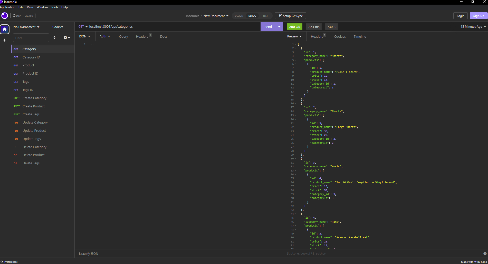

# Challenge 13: Ecommerce Backend

## Description

With this application, the backend for your company is complete! You can now create new products for your company, update products, delete products and let users view whatever your company has to offer!

## Table of Contents

- [Description](#description)
- [Installation](#installation)
- [Usage](#usage)
- [License](#license)
- [Contributing](#contributing)
- [Tests](#tests)
- [Questions](#questions)

## Installation

To install this application, simply clone the repo/source code and run the required inquiries in your terminal using npm i, mysql and npm run seed.

## Usage

The usage for this application is very simple. Simply run the code on your terminal and begin updating your backend using the code!

## License

MIT

## Contributing

Gustavo Diaz

## Tests

Video Link: 
https://drive.google.com/file/d/1tKcoUr9b8DVnZkVmohNSN-OasHmz8bMd/view

## Questions

NA

For more information, visit my GitHub profile: [diazgus411](https://github.com/diazgus411)

To contact me, send an email to: "diazgus411@gmail.com"